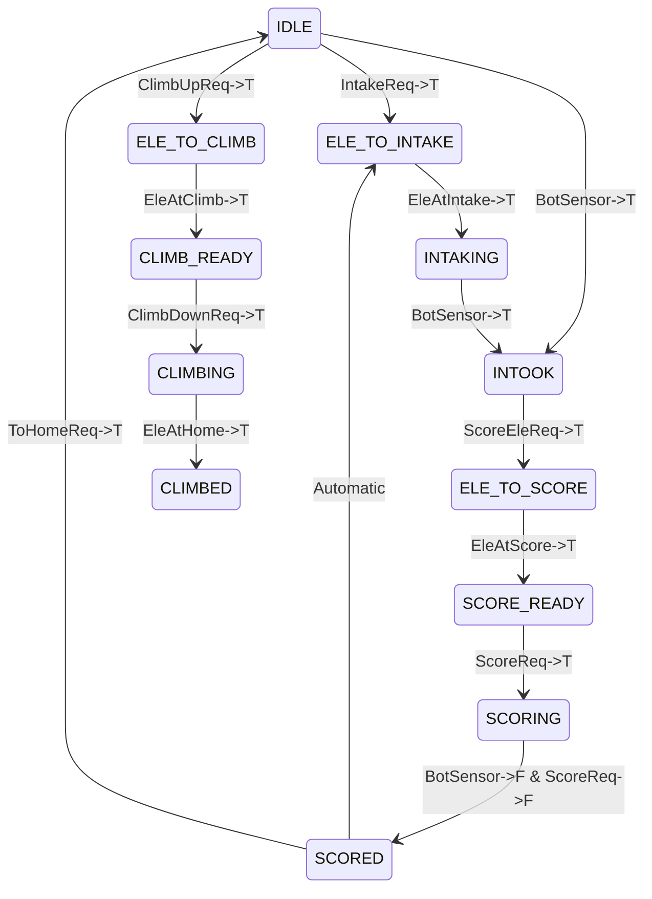

# Superstructure

## Subsystems

-   **Coral**
    - 1 TalonFX: connected to wheels that move the CORAL through the subsystem
    - 2 DigitalInputs: one sensor at the top of the subsystem that checks when a CORAL enters the system and one sensor at the bottom ofthe subsystem that checks when a CORAL is fully intook and when it exits the system
-   **Elevator**
    -   2 Krakens: moves elevator up and down

## States

### State Diagram

This diagram is very basic, and I'm sleepy. NOTE: there are technically different states for each height in ELE_TO_SCORE

### Output Truth Table

|    **State**     | **Coral** |**Elevator**   | **Open Requests**  |
| :--------------: | :-------: | :-----------: | :----------------: |
|     **IDLE**     | Unrunning |    HOME       | IntakeReq, ClimbReq|
|**ELE_TO_INTAKE** | Unrunning |Move->INTAKE   | n/a                |
|  **INTAKING**    | Running   | INTAKE        | n/a                |
|  **INTOOK**      | Unrunning | INTAKE        | ScoreEleReq        |
|  **ELE_TO_SCORE**| Unrunning |Move->SCORE    | n/a                |
| **SCORE_READY**  | Unrunning | SCORE         | ScoreReq           |
| **SCORING**      | Running   |  SCORE        | n/a                |
| **SCORED**       | Unrunning | SCORE         | n/a                |
| **ELE_TO_CLIMB** | Unrunning |Move->CLIMBUP  | n/a                |
| **CLIMB_READY**  | Unrunning | CLIMBUP       | ClimbDownReq       |
| **CLIMBING**     | Unrunning |Move->CLIMBDOWN| n/a                |
| **CLIMBED**      | Unrunning | HOME          | n/a                |     

## Inputs

### Hardware

#### Digital Inputs

- TopSensor: watching for CORAL entering system
- BotSensor: watching for:
    - CORAL being fully intook
    - CORAL exiting the system

#### Numeric Signals (Motors/Encoders)

-   Elevator At Height
    - it's a MMEV thingy

### Software

#### Control Signals (Human/Autonomous Requests)

- Auton
    - Auton Elevator Requests:
        - Two (HP, Reef)
    Override Requests:
        - Intake Override: goes to Intaking anyway if robot path reaches the HP station without being Intake Ready
        - Score Override: scores anyway if robot has been at the reef for more than a second without being Score Ready
        - Preload Request: goes straight from Idle -> Intook
            - Only exists during the first scoring iteration in Auton
- Teleop (Button Binds)
    - Driver Requests:
        - Elevator Request
        - Score Request
    - Override Requests:
        - Intake Override (intake is usually automatic)
        - Score Override: scores anyway regardless of state